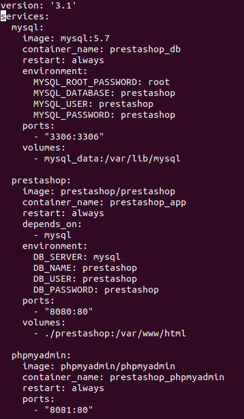
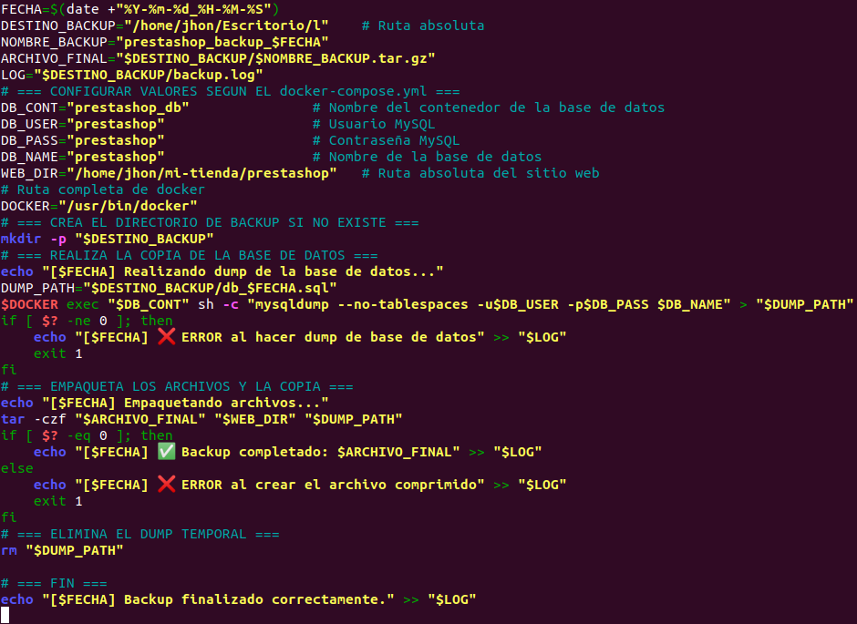

# 🛒 Proyecto: Tienda Online Automatizada con Docker + PrestaShop

Este proyecto fue desarrollado como parte del módulo final del Ciclo Superior de ASIR. Su objetivo es implementar una plataforma de comercio electrónico escalable y automatizada, utilizando tecnologías modernas como Docker, PrestaShop y Bash scripting.

---

## 🚀 Tecnologías utilizadas

- 🐳 Docker & Docker Compose
- 🛍️ PrestaShop
- 🖥️ Apache + MariaDB
- 📜 Bash + Cron
- 🌐 Bootstrap (landing page)

---

## 📸 Capturas destacadas

### 🔧 Infraestructura Docker

### 🌐 Landing page desarrollada con Bootstrap

### 🛒 Interfaz de la tienda en PrestaShop

### 💾 Automatización de backups

---

## 🧠 Descripción del proyecto

Automathkey es una empresa ficticia de domótica que requería una tienda online moderna y funcional. Este sistema incluye:

- Contenedores para PrestaShop, MariaDB, Apache y phpMyAdmin.
- Automatización de copias de seguridad con Bash y cron.
- Landing page responsive con Bootstrap.
- Restauración del sistema a partir de backups.

---

## 📄 Documentación completa

Puedes ver la memoria técnica completa del proyecto aquí:  
➡️ [Ver documento (PDF en Google Drive)](https://docs.google.com/document/d/1E7pOCnYzE9r1HPJGu_PJbKoeVVQ9rlQfb5D_WxGU61s/edit?usp=sharing)

---

## 👨‍💻 Autor

**Jhon Edinson Bermudez Blandon**  
Técnico en Administración de Sistemas Informáticos en Red  
[LinkedIn](https://www.linkedin.com/in/jhon-edinson-bermudez-blandon-980622349/) | [GitHub](https://github.com/Jhonn-SysAdmin-Dev-Junior)
